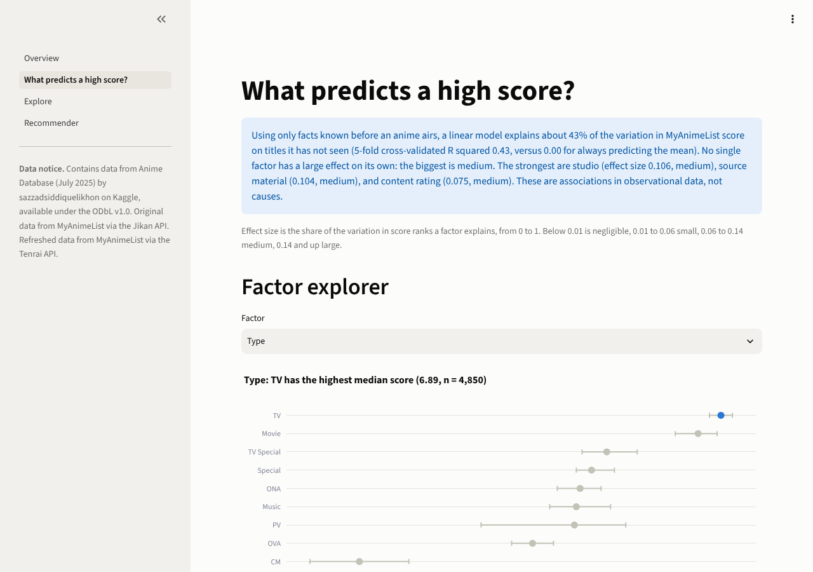
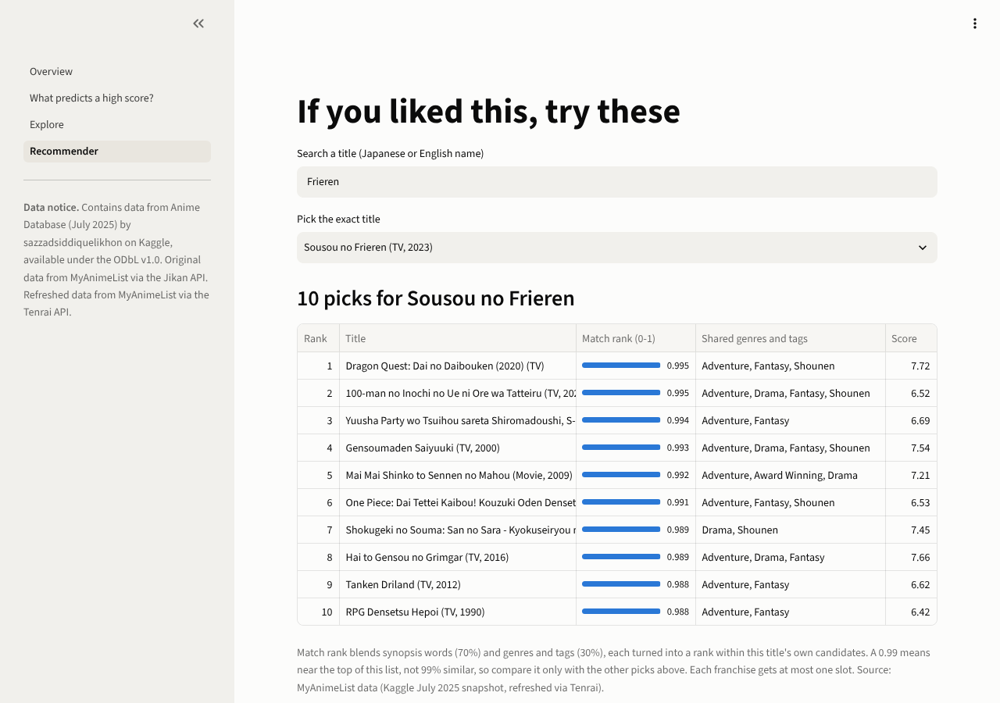
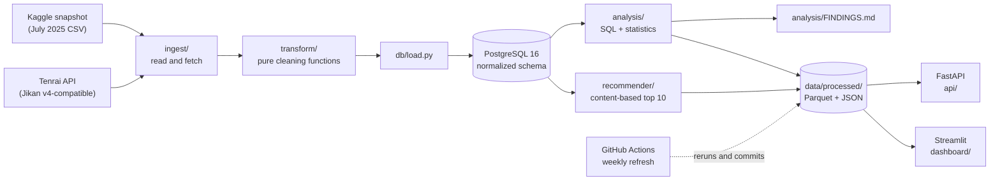

# AniPulse

[](https://github.com/WanderingPsan/anipulse/actions/workflows/ci.yml)

AniPulse is an end-to-end anime analytics platform: a pipeline loads about 27,000 MyAnimeList
titles into PostgreSQL, and an analysis asks which factors known before an anime airs are
associated with a higher MyAnimeList score. It also serves "if you liked X, try these"
recommendations through a FastAPI service and a Streamlit dashboard.

- **Live dashboard:** _link added at deploy_
- **Live API:** _link added at deploy_

## Headline finding

Using only facts known before an anime airs (type, source material, studio, content rating,
demographic, episodes, episode length, year, season, genres, and themes), a linear model
explains about **43%** of the variation in score on titles it has not seen (5-fold
cross-validated R squared 0.43, versus 0.00 for always predicting the mean), fit on
**12,582** titles. No single factor has a large effect on its own. The strongest are
**studio**, **source material**, and **content rating**, each with a medium effect size. These
are associations in observational data, not causes.

_Numbers from the data as of 2026-10-09. A weekly job refreshes the data and regenerates
[analysis/FINDINGS.md](analysis/FINDINGS.md), so see it for the latest numbers and every
table behind them._





<sub>Contains data from Anime Database (July 2025) by sazzadsiddiquelikhon on Kaggle, available
under the ODbL v1.0. Original data from MyAnimeList via the Jikan API. Refreshed data from
MyAnimeList via the Tenrai API.</sub>

## Architecture



The database is the single source of truth while the pipeline runs. The API and the dashboard
read small prebuilt files from `data/processed/` instead of the database, so they stay fast,
cost nothing to host, and keep working if the anime API is down.

## Run it locally

These commands are for Windows PowerShell, from the repo root. You need Python 3.13 and Docker
Desktop.

Set up a virtual environment and install everything:

```
python -m venv .venv
.venv\Scripts\Activate.ps1
python -m pip install -r requirements-dev.txt
Copy-Item .env.example .env
```

Look at the dashboard and the API. They read the committed files in `data/processed/`, so they
need no database:

```
python -m streamlit run dashboard/app.py
```

```
python -m uvicorn api.main:app --reload
```

The dashboard opens at http://localhost:8501. The API docs are at http://127.0.0.1:8000/docs.
Endpoints: `GET /health`, `GET /anime/search?q=`, `GET /anime/{mal_id}`, and
`GET /recommend/{mal_id}?k=10`. Set `ANIPULSE_DATA_DIR` to read the files from another folder.

Rebuild the data yourself: start Postgres, create the tables, load the CSV plus 4 pages from
the Tenrai API, then rerun the analysis and the recommender:

```
docker compose up -d db
python -m db.init
python -m pipeline.run --base csv --api-pages 4
python -m analysis.run
python -m recommender.build
```

Or run the same four steps in a container, the way the weekly refresh does:

```
docker compose run --rm pipeline
```

Either way, the outputs land in your own `data/processed/` and `analysis/FINDINGS.md`. The
weekly refresh commits those same files, so undo a local run before your next `git pull`, or
the pull fails with "local changes would be overwritten":

```
git restore data/processed analysis/FINDINGS.md
```

Run the API in Docker (Python slim image, non-root user, the API code and `data/processed/`
only):

```
docker compose up --build api
```

Run the tests and the linter:

```
python -m pytest -q
ruff check .
ruff format --check .
```

## Automation

- **CI** (`.github/workflows/ci.yml`): every push and pull request to `main` runs `ruff check`,
  `ruff format --check`, and the full test suite against a PostgreSQL 16 service container.
  It also builds the Docker image, starts it, and calls `/health`.
- **Weekly refresh** (`.github/workflows/refresh.yml`): every Monday at 13:17 UTC, and on demand,
  it reloads the Kaggle snapshot, refreshes the top 4 pages of anime from the Tenrai API,
  reruns the analysis and the recommender, and commits `data/processed/` and
  `analysis/FINDINGS.md` if they changed. A live API outage does not fail the run. A failed
  CSV load does.
- **Hosting** (`render.yaml`): a free Render web service that installs `api/requirements.txt`,
  starts uvicorn on Render's `$PORT`, and checks `/health` before switching traffic to a new
  deploy.

## Data sources and licenses

- **Anime Database (July 2025)** by sazzadsiddiquelikhon on Kaggle: a MyAnimeList snapshot of
  28,000+ titles, committed at `data/source/`. This is the backbone.
- **Tenrai API** (`api.tenrai.org`): a Jikan v4-compatible MyAnimeList API that refreshes the
  top-ranked titles. The base URL is a setting (`ANIME_API_BASE_URL`), so any Jikan
  v4-compatible server works.
- **MyAnimeList genre reference**: the genre, theme, and demographic list, saved once to
  `data/reference/mal_genres.json` so builds never depend on the API.

Adult (Rx) titles are removed during transform and never reach the database.

The code is under the MIT License (see [LICENSE](LICENSE)). The dataset and every derived data
file in `data/processed/` are under the ODbL v1.0 (see [DATA_LICENSE.md](DATA_LICENSE.md)).
Every chart and page that shows the data carries this notice:

> Contains data from Anime Database (July 2025) by sazzadsiddiquelikhon on Kaggle, available
> under the ODbL v1.0. Original data from MyAnimeList via the Jikan API. Refreshed data from
> MyAnimeList via the Tenrai API.

## Limitations

- **Association, not causation.** This is observational data. A studio's high median score may
  reflect the projects it is offered, not what it does to them.
- **MyAnimeList users are not everyone.** Scores reflect the people who use the site and choose
  to rate a title.
- **Only scored titles with at least 1,000 members are analyzed.** Obscure titles are
  under-represented, and they likely score lower.
- **Recent years are incomplete.** The snapshot is from July 2025, and the live refresh covers
  only the top-ranked pages, so titles after 2024 are not a full picture of those years.
- **The recommender is content-based.** It matches synopsis words and tags, not what users
  actually watched, so it finds similar shows, not necessarily ones a given person will like.

## Project structure

```
anipulse/
├── ingest/           read the Kaggle CSV, fetch from the Tenrai API
├── transform/        pure cleaning functions (no database, no network, no files)
├── db/               SQLAlchemy models, table creation, loading
├── pipeline/         run.py: extract, transform, load in one command
├── analysis/         SQL, statistics, FINDINGS.md and its template
├── recommender/      features, similarity, evaluation, build
├── api/              FastAPI service and its own requirements file
├── dashboard/        Streamlit app and its four pages
├── tests/            pytest suite and recorded API fixtures
├── data/
│   ├── source/       the Kaggle dataset (ODbL)
│   ├── reference/    MyAnimeList genre reference
│   └── processed/    small files the API and dashboard read (ODbL)
├── docs/img/         dashboard screenshots
├── .github/workflows/ CI and the weekly refresh
├── Dockerfile, docker-compose.yml, render.yaml
├── DECISIONS.md      every meaningful design decision
├── LICENSE           MIT, for the code
└── DATA_LICENSE.md   ODbL v1.0, for the data
```

## Key decisions

Every meaningful decision, with the reason, the alternatives, and the trade-off, is in
[DECISIONS.md](DECISIONS.md). A few examples: why `mal_id` is the primary key and not the title,
why only pre-release fields count as predictors, why results lead with effect sizes instead of
p-values, and why the API reads prebuilt files instead of the database.

## How I built this

I started thinking about this project in April and began the design in June. I wanted a topic I actually cared about, and I had started watching anime the year before, so I went with that. I designed the database schema (for example, mal_id as the key instead of the title, join tables for genres and studios, and lookup tables so each name is stored once) and decided which fields count as known before an anime airs. Score, members, and rank are outcomes, so they are never used as predictors, and using rank to explain score would be circular.

I wrote some early prototype code myself, then decided this was a good chance to explore AI-assisted coding to build it out faster, while still making sure I understood each step and the actual tedium of code that was being produced by myself and it. Each component went through its own pull request with tests, and I reviewed every plan and every change before merging it. Every decision and its trade-off is written down in DECISIONS.md.
